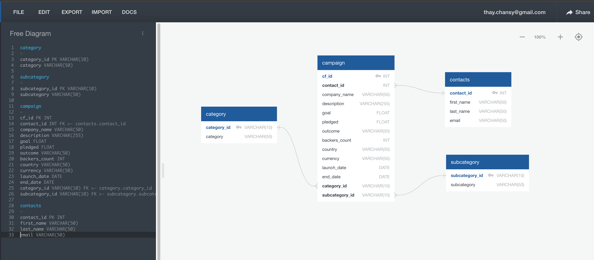
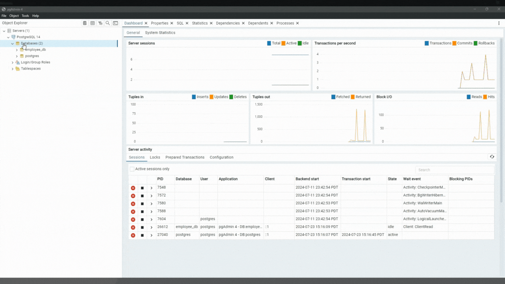
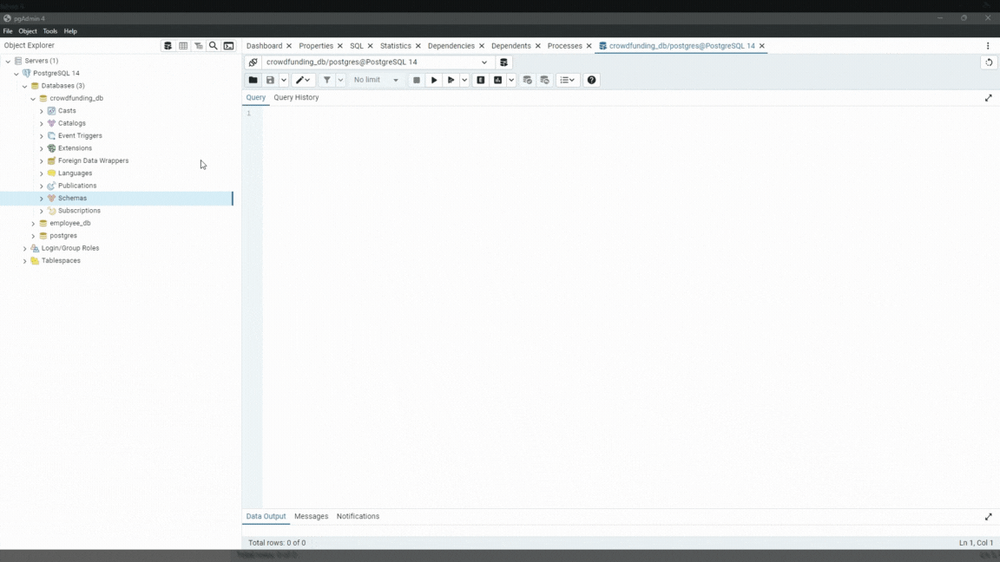
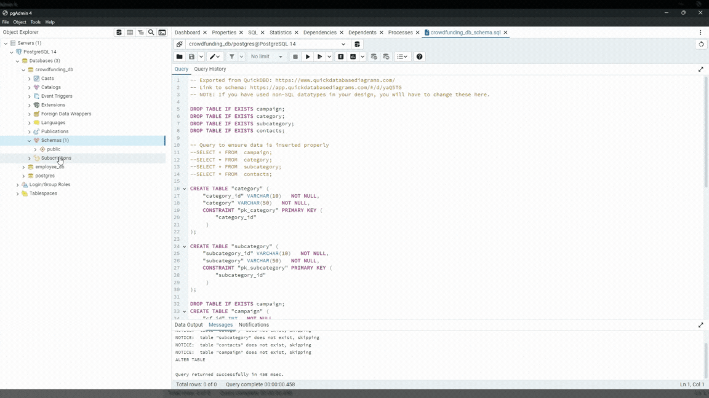
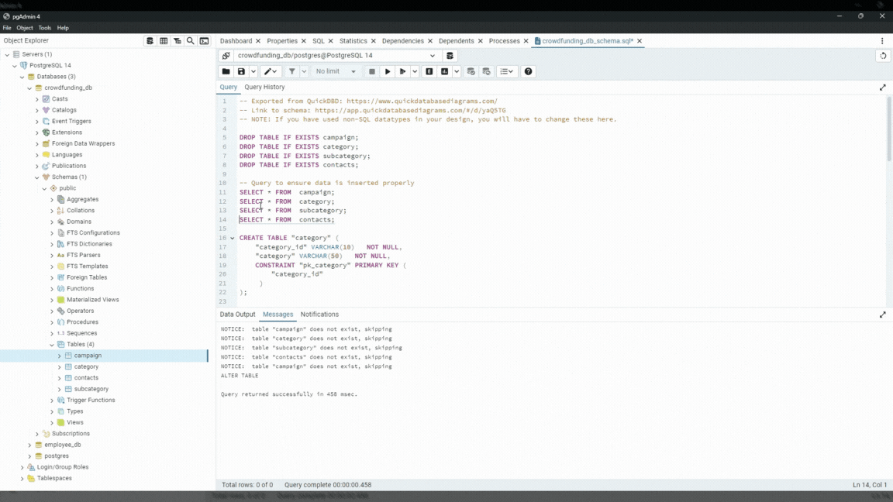

<h1  align="center">Crowdfunding ETL Project</h1>

<!-- TABLE OF CONTENTS -->

Table of Contents
<ol>
<li><a href="#about-the-project">About The Project</a></li>
<li><a href="#built-with-python-and-postgressql-framework">Built With Python and PostgresSQL Framework</a></li>
<li><a href="#contributing">Contributing (UC Berkeley Bootcamp Students Only) </a></li>
<li><a href="#contact">Contact</a></li>
<li><a href="#acknowledgments">Acknowledgments</a></li>
</ol>

<!-- ABOUT THE PROJECT -->

## About The Project

### Instructions
The instructions for this mini project are divided into the following subsections:

- Create the Category and Subcategory DataFrames
- Create the Campaign DataFrame
- Create the Contacts DataFrame
- Create the Crowdfunding Database

## Create the Category and Subcategory DataFrames

1. Extract and transform the `crowdfunding.xlsx` Excel data to create a category DataFrame that has the following columns:

- A `category_id` column that has entries going sequentially from `cat1` to `catn`, where n is the number of unique categories

- A `category` column that contains only the category titles

2. Export the category DataFrame as `category.csv`.

3. Extract and transform the `crowdfunding.xlsx` Excel data to create a subcategory DataFrame that has the following columns:

- A `subcategory_id` column that has entries going sequentially from `subcat1` to `subcatn`, where n is the number of unique subcategories

- A "subcategory" column that contains only the subcategory titles

- The following image shows this subcategory DataFrame:

4. Export the subcategory DataFrame as `subcategory.csv`. 

<kbd>  </kbd>

## Create the Campaign Dataframe

We're tasked with extracting specific columns from a crowdfunding dataset, cleaning and transforming them, and creating a new DataFrame called `campaign_df`. This DataFrame will serve as the foundation for further analysis.

### Explanation
1. Import pandas: Imports the Pandas library for data manipulation.

2. Load Excel data: Reads the `crowdfunding.xlsx` file into a Pandas DataFrame.

3. Create `campaign_df` DataFrame: Creates a new DataFrame with selected columns and necessary transformations.
- `cf_id`, `contact_id`, `company_name`, `outcome`, `backers_count`, `country`, and `currency` columns are directly assigned.
- `blurb` is renamed to `description`.
- `goal` and `pledged` are converted to float data types.
- `launched_at` and `deadline` are converted to `datetime` format with UTC conversion.
- `category_id` and `subcategory_id` are assigned.

### Additional Considerations:
1. Data Cleaning: Ensure the data in the Excel file is clean and consistent before creating the DataFrame.
2. Timezones: If the timestamps in `launched_at` and `deadline` are in a different timezone, adjust the `pd.to_datetime` function accordingly.
3. Performance: For large datasets, consider using optimized methods for data conversion and creation.
4. Mapping `category_id` and `subcategory_id`: These columns will be created based on the category and subcategory DataFrames created earlier. This will involve using mapping or merging operations.

By following these steps, this should have a well-structured campaign DataFrame ready for further analysis.

<kbd>  </kbd>

## Create the Contacts DataFrame

Choose one of the following two options for extracting and transforming the data from the `contacts.xlsx` Excel data:

- Option 1: Use Python dictionary methods.

- Option 2: Use `regex` regular expressions.

### Choosing Option 1: Reasoning for Using Python Dictionary Methods

Option 1, using Python dictionary methods, would be suitable for scenarios where:
- Data is irregular or unstructured: If the data within the `contact_info` column is inconsistent or has varying formats, dictionary-based parsing might offer more flexibility.
- Detailed control over data extraction: You require granular control over the extraction process and have a clear understanding of the data structure.
- Performance is not critical: For smaller datasets or when performance is not a primary concern, dictionary-based processing can be a viable approach.

### Choosing Option 2: Reasoning for Using Regular Expressions

Option 2, using Regular Expressions `regex` methods, would be suitable for scenarios where:
- Efficiency: Regular expressions are generally more efficient for extracting specific patterns from text data compared to iterating over dictionaries.
- Directness: Directly extracting the desired columns using regular expressions is more concise.

<kbd>  </kbd>

## Create the Crowdfunding Database

1. Inspect the four CSV files, and then sketch an ERD of the tables by using `QuickDBDLinks` site.

<kbd>  </kbd>

2. Use the information from the ERD to create a table schema for each CSV file.

3. Save the database schema as a Postgres file named `crowdfunding_db_schema.sql`.

4. Create a new Postgres database, named `crowdfunding_db`.

<kbd>  </kbd>

5. Using the database schema, create the tables in the correct order to handle the foreign keys.

<kbd>  </kbd>

6. Verify the table creation by running a `SELECT` statement for each table.

7. Import each CSV file into its corresponding SQL table.

<kbd>  </kbd>

8. Verify that each table has the correct data by running a `SELECT` statement for each.

<kbd>  </kbd>

(<a  href="#readme-top">back to top</a>)

  
<!-- BUILT -->

## Built with Python and PostgresSQL Framework 

ETL is a data integration process that involves extracting data from various sources, transforming it into a desired format, and loading it into a target system for further analysis or processing. It's a critical component of data warehousing and business intelligence solutions.

1. Extraction
- Data Sources: This phase involves identifying and connecting to data sources, which can include databases (SQL, NoSQL), flat files (CSV, JSON, XML), APIs, or other systems.
- Data Retrieval: The data is extracted from these sources and fetched into the ETL process.

2. Transformation
- Data Cleaning: This phase involves handling missing values, inconsistencies, and errors in the extracted data.
- Data Standardization: Data is formatted consistently across different sources.
- Data Enrichment: Additional data might be added or derived from existing data.
- Data Aggregation: Data is summarized or aggregated as required.
- Data Validation: Data integrity is checked to ensure accuracy.

3. Loading
- Target System: The transformed data is loaded into a target system, such as a data warehouse, data mart, or operational database.
- Data Storage: Data is stored in a structured format for efficient querying and analysis.
  
  
(<a  href="#readme-top">back to top</a>)

<!-- CONTRIBUTING -->

## Contributing 

(UC Berkeley Bootcamp Students Only)  

Contributions are what make the open source community such an amazing place to learn, inspire, and create. Any contributions you make are **greatly appreciated**.

  

If you have a suggestion that would make this better, please fork the repo and create a pull request. You can also simply open an issue with the tag "enhancement".

Don't forget to give the project a star! Thanks again!

1. Fork the Project

2. Create your Feature Branch (`git checkout -b new-branch-name`)

3. Commit your Changes (`git commit -m 'Add some message'`)

4. Push to the Branch (`git push origin new-branch-name`)

5. Create a pull request. 

Forking a repository and creating a pull request on GitHub is a great way to contribute to open-source projects. Here's a breakdown of the process:

1. Forking the Repository:

Find the repository you want to contribute to on GitHub.
Click on the "Fork" button in the top right corner. This creates a copy of the repository in your own account.

2. Clone the Forked Repository to Your Local Machine

You'll need Git installed on your system.
Use Git commands to clone your forked repository to your local machine. There will be instructions on the GitHub repository page for cloning.

3. Making Changes (Local Work):

Make your changes to the code in your local copy.
Use Git commands to track your changes (adding, committing).

4. Pushing Changes to Your Fork:

Once you're happy with your changes, use Git commands to push your local commits to your forked repository on GitHub.

5. Creating a Pull Request:

Go to your forked repository on GitHub.
Click the "Compare & pull request" button (might appear as a yellow banner).
Here, you'll see a comparison between your changes and the original repository.
Write a clear title and description for your pull request explaining the changes you made.
Click "Create Pull Request" to submit it for review.

(<a  href="#readme-top">back to top</a>)

<!-- LICENSE -->

## License

Distributed under  GNU General Public License. See `LICENSE.txt` for more information.

(<a  href="#readme-top">back to top</a>)

<!-- CONTACT -->

## Contact

Thay Chansy - [@thaychansy](https://twitter.com/thaychansy) - or thay.chansy@gmail.com

Please visit my Portfolio Page: thaychansy.github.io (https://thaychansy.github.io/)

Project Link: [thaychansy/etl-project (Extract, Transform, and Load)](https://github.com/thaychansy/etl-project)
  

(<a  href="#readme-top">back to top</a>)

   
  

<!-- ACKNOWLEDGMENTS -->

## Acknowledgments

Here's a list of resources we found helpful and would like to give credit to. 

  
* [Chat GPT] [ChatGPT](https://chatgpt.com/)
* [Google Gemini] [Gemini Generative AI](https://gemini.google.com/app)
* [Stack Overflow] [Error Importing CSV File Into PostgreSQL](https://stackoverflow.com/questions/75869359/i-am-getting-an-error-when-importing-csv-file-into-postgresql)
  

(<a  href="#readme-top">back to top</a>)

